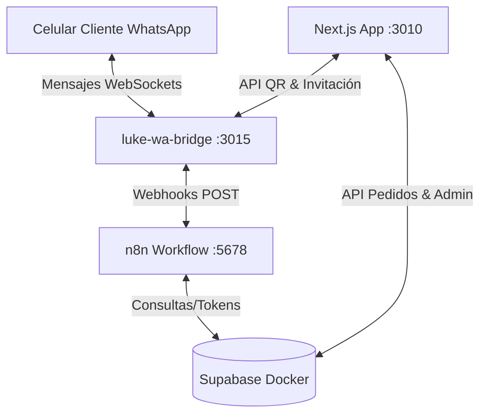

# 📦 LukeDelivery B2B — Sistema de Distribución Mayorista

LukeDelivery B2B es una plataforma logística y comercial diseñada para abastecer almacenes de barrio en **Placilla y Curauma** a costo real de distribuidor, cobrando un flete transparente calculado según la carga. 

Este repositorio contiene tanto la aplicación frontend/backend en **Next.js** como el microservicio de pasarela de WhatsApp (**`wa-bridge`**).

---

## 🗺️ Arquitectura del Sistema

El ecosistema corre en un servidor local (`lukeserver` Asus Laptop, 4GB RAM) y consta de 4 pilares:



1. **Next.js (Puerto 3010)**: La aplicación web principal que sirve el panel de administración, el formulario de registro y la toma de pedidos B2B.
2. **Supabase (Docker)**: Base de datos Postgres, motor de tiempo real (Realtime), autenticación y panel de administración de tablas (Studio en Puerto 54323).
3. **n8n (Docker en Puerto 5678)**: Orquestador de flujos de trabajo que recibe mensajes de WhatsApp, genera enlaces temporales y envía correos de alerta con formato HTML a logística.
4. **WhatsApp Web Bridge (Puerto 3015)**: Microservicio Node.js autónomo basado en la librería `@whiskeysockets/baileys` que se conecta a WhatsApp vía WebSockets sin consumir RAM de navegador (sin Puppeteer/Chrome).

---

## 🛠️ Funcionalidades Desarrolladas

### 1. Panel de Administración y Mapeo (`/admin-luke`)
Interfaz geográfica interactiva basada en **Leaflet** para el control de la operación logística:
*   **Ajuste Fino de Ubicación (Switch)**: Interruptor seguro en la barra superior que habilita el modo "arrastrar y soltar" (drag-and-drop) en los pines del mapa. Al soltar un marcador, solicita confirmación y actualiza de inmediato las coordenadas (Latitud/Longitud) en Supabase. Si está apagado, los pines quedan fijos previniendo desplazamientos accidentales.
*   **Alertas Logísticas en Tiempo Real**: Los almacenes que tienen pedidos en estado `Pendiente` o `Preparado` muestran un halo circular pulsante animado en el mapa, alertando visualmente al repartidor de la ruta.
*   **Sidebar de Detalle y Transiciones de Estado**: Barra lateral derecha fluida que detalla la mercadería del pedido, cálculo de fletes y un selector de estados (`Pendiente`, `Preparado`, `En Ruta`, `Entregado`, `Cancelado`) que actualiza Supabase de inmediato.
*   **Filtro "Mostrar solo activos"**: Opción en el sidebar para ocultar pedidos antiguos (`Entregado`/`Cancelado`), eliminando la sensación de duplicidad y despejando el listado.
*   **Catálogo Responsivo (Mobile Cards)**: El modal del catálogo de productos se adapta a dispositivos móviles. En celulares esconde la tabla ancha y renderiza un listado vertical de tarjetas táctiles, libre de textos recortados. Incluye un sanitizador automático (`cleanText`) para corregir errores de acentuación (`Estándar`, `Bidón`) procedentes de la base de datos.
*   **Captación de Clientes en Terreno (Invitar)**: Botón rápido en la barra superior para ingresar el nombre de un almacenero y su WhatsApp y enviarle una invitación redactada profesionalmente con el link de registro directo.

### 2. Pasarela de WhatsApp (`wa-bridge`)
*   **Conexión WebSocket**: Corre de forma eficiente consumiendo solo ~95MB de RAM.
*   **Ruta de Vinculación Web (`/api/qr-whatsapp`)**: Endpoint dinámico de Next.js que consume el microservicio local de WhatsApp y renderiza un portal web oscuro de alta fidelidad con recarga automática cada 8 segundos. Muestra el código QR como imagen de alta resolución (evitando la deformación de caracteres ASCII) y paneles de estado ("ESPERANDO ESCANEO", "CONECTADO").
*   **Envío y Recepción**: Endpoint `POST /send` para enviar mensajes y escucha activa en `messages.upsert` que reenvía todos los chats entrantes al webhook de n8n.

### 3. Registro Geolocalizado de Locales (`/registro`)
*   Formulario responsivo para nuevos almacenes (`nombreTienda`, `nombreContacto`, `whatsapp`, `sector`).
*   **Geolocalización GPS Obligatoria**: Valida la posición en terreno mediante el GPS del celular.
*   **Filtro Geográfico (Cerca Perimetral)**: Restringe el registro únicamente si las coordenadas GPS están dentro del cuadrante de servicio de Placilla y Curauma, protegiendo al negocio de registros falsos o fuera de ruta.

### 4. Formulario de Pedido Accesible (`/pedido`)
Optimizaciones especiales de diseño (Stitch CSS) pensadas para dueños de almacén de edad avanzada:
*   **Legibilidad Máxima**: Tipografía *Atkinson Hyperlegible Next* cargada de forma global.
*   **Facilidad Motora**: Botones de acción gigantes (mínimo `56px` a `64px` de alto) y bordes de alto contraste.
*   **Simulación del Furgón**: Barra de progreso y banner superior gigante que calculan dinámicamente el flete del furgón ($3.000 base + $500 por bulto pesado) y muestran el avance hacia el mínimo de compra de $35.000.
*   **Tokens Temporales Seguros**: Los links enviados desde WhatsApp contienen un parámetro `?token=UUID` asociado a la tabla `sesiones_formulario`. Al entrar:
    1. El sistema valida el token y bloquea los inputs del cliente (impide suplantación de números).
    2. Al confirmar la compra, guarda el pedido, marca el token como `usado = true` y lo inhabilita (si el usuario presiona F5 o recarga, el enlace ya no funciona).

---

## 🔄 Flujos de Usuario (Ejemplos Paso a Paso)

### 📋 Flujo A: Captación en Terreno (Prospectos)
Este flujo lo utilizas cuando sales a la calle a reclutar nuevos almacenes:
```
[Tú en la Calle] ➡️ Abre admin-luke ➡️ Botón "Invitar" ➡️ Digitas Nombre y WhatsApp ➡️ Enviar
                                                                          ⬇️
[Almacenero] ⬅️ Recibe WhatsApp con Link ⬅️ Envío Automático desde tu número vinculado
     ⬇️
Abre Link (/registro) ➡️ Otorga permiso GPS ➡️ Completa sus datos ➡️ Clic en Registrar
                                                                          ⬇️
[Sistema] Registra en Supabase ➡️ Redirige a /pedido?cliente_id=... ➡️ Almacenero ve su catálogo al costo
```

### 🛍️ Flujo B: Compra Segura desde WhatsApp (Cliente Registrado)
Este flujo automatiza la toma de pedidos a clientes que te escriben al WhatsApp:
```
[Cliente] Envía mensaje a tu WhatsApp: "Quiero hacer un pedido"
                                ⬇
[n8n Webhook] Recibe el mensaje ➡️ Busca el número en la tabla "clientes"
                                ⬇
[n8n Webhook] Crea sesión temporal en Supabase ➡️ Obtiene Token UUID
                                ⬇
[Cliente] ⬅️ Recibe mensaje automático con link: https://delivery.lukeapp.me/pedido?token=UUID
                                ⬇
Abre el enlace ➡️ Arma su pedido con la UI accesible ➡️ Presiona "Confirmar Pedido"
                                ⬇
[Next.js API] Procesa pedido ➡️ Guarda en Supabase ➡️ Invalida el Token (usado = true)
                                ⬇
[n8n Webhook] ⬅️ Recibe alerta de compra ➡️ Envía correo HTML de preparación a logística
```

---

## 🖥️ Gestión del Servidor y Puertos

Para maximizar el rendimiento del servidor Asus de 4GB de RAM, la infraestructura de producción de este proyecto consta de los siguientes servicios activos:

### 📊 Servicios Activos
| ID (PM2) | Nombre del Proceso | Puerto | Rol / Descripción |
| :---: | :--- | :---: | :--- |
| **5** | `luke-delivery-prod` | `3010` | Aplicación web principal (Next.js) |
| **6** | `luke-wa-bridge` | `3015` | Microservicio de WhatsApp (Baileys) |
| **1** | `deploy-webhook` | `9000` | Webhook de despliegue automático de Git |
| **Docker**| `n8n` | `5678` | Motor de flujos de automatización |
| **Docker**| `supabase-stack` | `8000` / `54323` | Base de datos PostgreSQL y Studio administrador |

---

## 🚀 Despliegue Automático (Push-to-Deploy)

El proyecto cuenta con integración continua automática. Al realizar cambios en tu PC local:
1. Envías los cambios a GitHub:
   ```bash
   git add .
   git commit -m "Descripción de los cambios"
   git push origin main
   ```
2. El repositorio de GitHub dispara un webhook a `https://deploy.lukeapp.me/webhook`.
3. El servidor recibe la alerta, ejecuta el script `~/deploy/deploy-delivery.sh`, descarga el código, ejecuta el build de Next.js y reinicia el proceso en PM2 de forma transparente.
